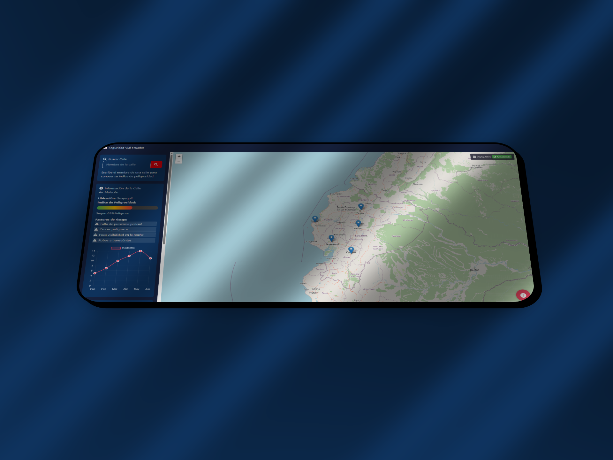

# Riesgos EC

Riesgos EC es una innovadora plataforma web desarrollada con React y Django REST Framework, diseñada para revolucionar la seguridad y el control del transporte en Ecuador. Este proyecto combina tecnología avanzada y usabilidad para ofrecer a los usuarios una herramienta poderosa que les permita conocer en tiempo real las zonas más peligrosas por donde se desplazan. Con funciones destacadas como el Top 10 de calles más peligrosas, la plataforma identifica y visualiza las áreas con mayor índice de riesgos, ayudando a los ciudadanos a tomar decisiones más seguras en sus rutas diarias. Además, cuenta con un Botón de Pánico que permite reportar incidentes de forma rápida y sencilla, facilitando la alerta inmediata de emergencias en diferentes sectores del país. La inteligencia artificial integrada analiza todas las evidencias y reportes recibidos, proporcionando un análisis detallado y preciso de cada situación, lo que contribuye a una gestión más eficaz de la seguridad ciudadana. Riesgos EC no solo es una herramienta informativa, sino también un aliado activo en la prevención y respuesta ante situaciones peligrosas, con el objetivo de mejorar la calidad de vida y la tranquilidad de los habitantes de Ecuador.

